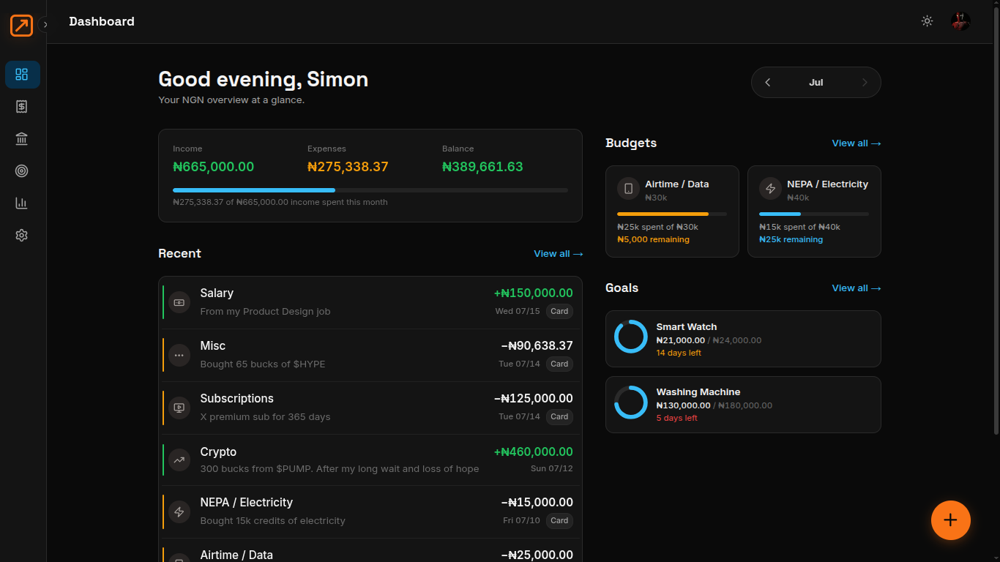
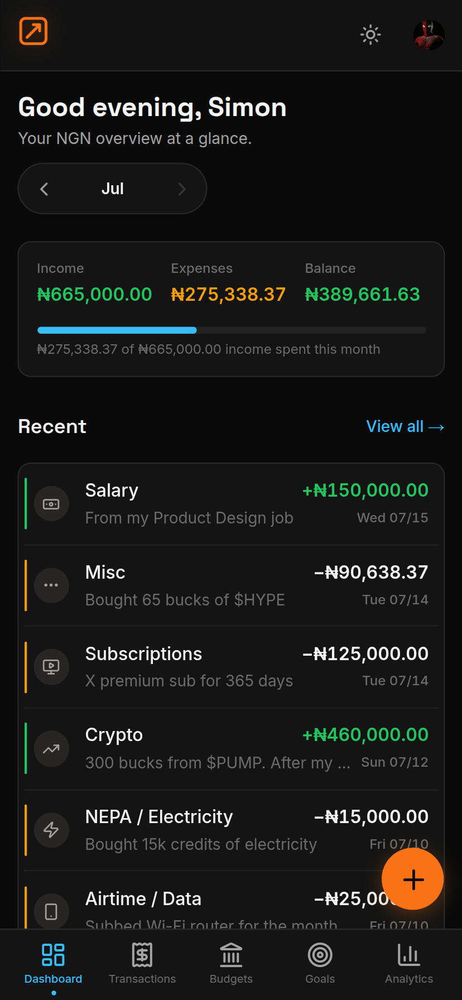

# Ledger

A personal finance tracker built for Nigerian realities — NGN-first transaction logging, category budgets, savings goals, and spending analytics.

[](./LICENSE)

## Demo

**Dashboard — desktop**



**Mobile experience**



[Live app](https://ledgerix.vercel.app)

## Features

- **Fast transaction logging** — add income or expenses in under 10 seconds via the floating action button. Optimistic updates, draft persistence, and undo on delete.
- **Category budgets** — set monthly spending limits per category. Progress bars update in real time as transactions are logged. Color shifts at 75% (amber) and 100%+ (red).
- **Savings goals** — define targets with deadlines, log contributions manually, and track progress through progress rings.
- **Dashboard overview** — income/expense balance for the current month, budget health cards, active goals preview, and recent transactions.
- **Spending analytics** — category breakdowns, income vs expenses summaries, month-over-month comparison, daily spending trends, and money leak detection.
- **Recurring transactions** — templates for salary, subscriptions, and regular expenses with due-date prompts. Confirm to log, skip to advance.
- **Nigerian-first design** — NGN-only with default categories for Transport, Feeding, Airtime/Data, NEPA, College, and more. Timezone-aware display in Africa/Lagos.
- **Dark + light themes** — persistent theme toggle with CSS custom properties throughout. WCAG AA contrast in both modes. Tabular figures on all monetary amounts.
- **Mobile-first** — installable PWA layout with bottom navigation and touch targets above 44px. Collapsible desktop sidebar with portal tooltips.

## Tech Stack

| Layer | Technology |
|---|---|
| Framework | Next.js 16 (App Router) |
| Language | TypeScript (strict) |
| Auth | Clerk (Custom Session Tokens) |
| Database | Supabase (Postgres + RLS) |
| Styling | Tailwind CSS 4 + shadcn/ui |
| Server cache | TanStack Query |
| Client state | Zustand |
| Charts | Recharts |
| Forms | React Hook Form + Zod |
| Hosting | Vercel |

## Prerequisites

- Node.js 20+
- A Supabase project
- A Clerk application

## Installation

```bash
git clone https://github.com/Venmarc/Ledger.git
cd Ledger
npm install
```

Copy the environment variables template and fill in your keys:

```bash
cp .env.example .env.local
```

Required variables:

| Variable | Source |
|---|---|
| `NEXT_PUBLIC_CLERK_PUBLISHABLE_KEY` | Clerk dashboard |
| `CLERK_SECRET_KEY` | Clerk dashboard |
| `NEXT_PUBLIC_SUPABASE_URL` | Supabase project settings |
| `NEXT_PUBLIC_SUPABASE_ANON_KEY` | Supabase project settings |
| `SUPABASE_SERVICE_ROLE_KEY` | Supabase project settings |
| `CURRENCY_API_KEY` | ExchangeRate API (for currency widget) |
| `CURRENCY_API_URL` | ExchangeRate API base URL |

Set up the database schema from `SCHEMA.md` — create all six tables, enable RLS, apply triggers, and create indexes. Then run the category seed:

```bash
npx tsx scripts/seed_categories.ts
```

Configure the Clerk-to-Supabase JWT bridge:

```bash
node scripts/setup-clerk-supabase-jwt.mjs
```

## Quick Start

```bash
npm run dev
```

Open `http://localhost:3000`. Sign up for an account. The app auto-seeds 13 Nigerian default categories on first login. Use the orange floating action button to start logging transactions.

The landing page is at `/` (public). All app routes (`/dashboard`, `/transactions`, `/budgets`, `/goals`, `/analytics`, `/recurring`, `/settings`) require authentication and redirect to `/sign-in` if unauthenticated.

## Project Structure

```
Ledger/
  PRD.md                              # Product vision, modules, non-goals
  TRD.md                              # Technical decisions, auth bridge, proxy pattern
  SCHEMA.md                           # Complete database schema + RLS + indexes
  PHASES.md                           # Implementation phases + gate conditions
  PAGE_SPECS.md                       # All 13 page layouts and behavior specs
  app/                                 # Next.js App Router pages
  components/                         # React components (transactions, budgets, goals, analytics, dashboard, UI primitives)
  lib/                                # Server actions, hooks, validations, types, utilities, Supabase clients
  scripts/                            # Category seed, Clerk-Supabase JWT bridge, SQL migrations
  public/                             # Static assets (hero art, screenshots, favicon, logo)
```

## License

Licensed under the [MIT License](./LICENSE).

---

*Built by Venmarc*